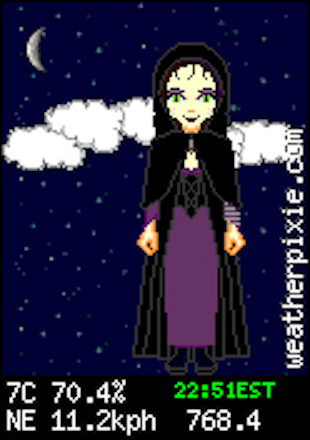
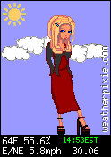
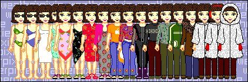
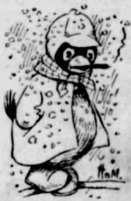
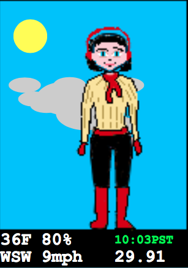
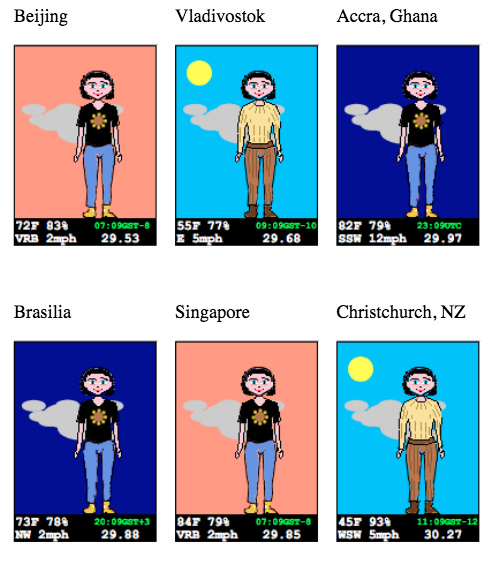
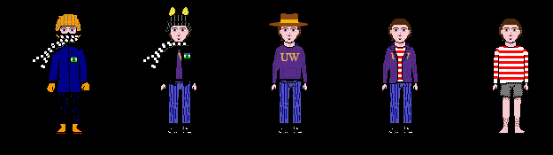
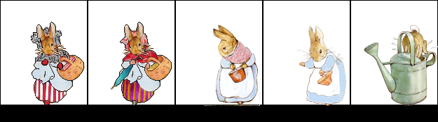
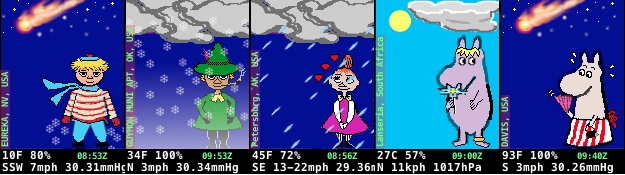
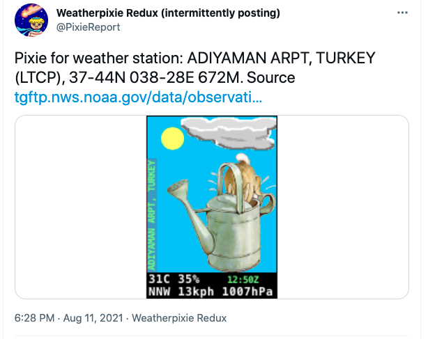

# Weatherpixie Redux


## An homage to Tamsin Bowles' pixel art paperdoll weather reports

I was enchanted by the combination of cuteness, content, and customizability wrapped up in Tamsin Bowles' site, weatherpixie.com .  When her site had a drive failure, and never came back up, and then I never heard from Tamsin, I thought of recreating the site.


# What is it?


## What's a Weatherpixie?


### A "Tamsin" Weatherpixie




Stretched to 250% to show detail.


### What's in a Weatherpixie?

Tamsin's **weatherpixies** were image compositions with these layers, back to front:


1. Day or night background including sun or moon, with pink near dawn and dusk. (Moon probably symbolic and not reflecting phase or visibility).
2. Background weather conditions (clouds)
3. Pixel doll image dressed according to temperature (more or fewer clothes) and possibly precipitation. There were multiple choices according to Tamsin's whims, rendering of herself and friends as pixel dolls, etc. There might be a dog or cat.
4. Holiday accessories.
5. Foreground weather indication such as raindrops or wisps of fog.
6. Site signature "weatherpixie.com"

Below the pixie were quantitative weather stats including:

1. Temperature in °C or °F
2. Relative humidity
3. Time (time the picture was composed, not the weather report time).
4. Wind speed in KPH or MPH and compass direction
5. Barometer reading in millibars or inches of mercury

The original format was small, 124 pixels wide x 175 pixels high. You could embed it on your home page by saving a URL which encoded your choice of location, units (for temperature and wind speed), and the ID number of the pixel doll set you wanted.

Another "Tamsin" pixie showing a daytime rendering with a different pixel doll, but the same cloud layer behind the figure. This one is at 100% to give a sense of the original size.





### Tamsin Pixie Tableau from @miramanga

Source URL: [https://twitter.com/miramanga/status/1092320373083947009](https://twitter.com/miramanga/status/1092320373083947009)





### Other Pixies: The St. Louis Post-Dispatch Weatherbird

[https://en.wikipedia.org/wiki/Weatherbird](https://en.wikipedia.org/wiki/Weatherbird)





Thanks to Tim Hutchings of Portland, OR for the Weatherbird reference [https://twitter.com/TimHutchingsFTW](https://twitter.com/TimHutchingsFTW)


## METAR: Weather Data Behind the Weatherpixie


### Meteorological Aerodrome Reports (METARs)

The data source for a given weatherpixie was the most recent airport weather report (METAR) for a given airport. These are available on the Web in textual form, compressed into a telegraphic form as if sent via telex or teletypewriter, like the cryptic and ominous TTY messages in Crichton's The Andromeda Strain.


```

KSEA 110353Z 33006KT 10SM FEW050 22/13 A2997 RMK AO2 SLP154 T02170128
```


METAR weather reports are a standard format including points of interest for aviation.

Here is an example from NOAA. "KSEA" is the airport code for Seattle-Tacoma International Airport. The gray-background text is parsed into time, wind direction, visibility, cloud cover, temperature/dewpoint temperature, barometric pressure, and a few things I can't remember, after RMK for remarks ("RMK AO2 SLP154 TO270128")

[https://www.aviationweather.gov/metar/data?ids=KSEA&format=decoded&hours=0&taf=off&layout=on](https://www.aviationweather.gov/metar/data?ids=KSEA&format=decoded&hours=0&taf=off&layout=on)

**Data at: 0419 UTC 11 Aug 2020**


<table>
  <tr>
   <td><strong>METAR for:</strong>
   </td>
   <td>KSEA (Seattle-Tacoma Intl, WA, US)
   </td>
  </tr>
  <tr>
   <td><strong>Text:</strong>
   </td>
   <td><strong>KSEA 110353Z 33006KT 10SM FEW050 22/13 A2997 RMK AO2 SLP154 T02170128</strong>
   </td>
  </tr>
  <tr>
   <td><strong>Temperature:</strong>
   </td>
   <td>21.7°C ( 71°F)
   </td>
  </tr>
  <tr>
   <td><strong>Dewpoint:</strong>
   </td>
   <td>12.8°C ( 55°F) [RH = 57%]
   </td>
  </tr>
  <tr>
   <td><strong>Pressure (altimeter):</strong>
   </td>
   <td>29.97 inches Hg (1015.0 mb) [Sea level pressure: 1015.4 mb]
   </td>
  </tr>
  <tr>
   <td><strong>Winds:</strong>
   </td>
   <td>from the NNW (330 degrees) at 7 MPH (6 knots; 3.1 m/s)
   </td>
  </tr>
  <tr>
   <td><strong>Visibility:</strong>
   </td>
   <td>10 or more sm (16+ km)
   </td>
  </tr>
  <tr>
   <td><strong>Ceiling:</strong>
   </td>
   <td>at least 12,000 feet AGL
   </td>
  </tr>
  <tr>
   <td><strong>Clouds:</strong>
   </td>
   <td>few clouds at 5000 feet AGL
   </td>
  </tr>
</table>


METARs are accompanied by TAFs (Terminal Aviation Forecasts). The Weatherpixie only uses the most recent METAR report. Sometimes the METAR report is a few hours old, so the weather conditions may not match the pixie generation time indicated by the sky and clock hours.


### Alternative Weather Report Sources

OpenWeatherMap [https://openweathermap.org/examples](https://openweathermap.org/examples) . Used for a Recurse Center project.


## Weatherpixie.com Features


1. Pixie Creation Wizard:
    1. Geographic picker to find the nearest airport to a location, or search by continent and country. Yields an airport code.
    2. Pixie Doll Picker. Each has a description and is encoded by a small integer ID.
    3. Unit picker (mph/kph, °F/°C)
    4. Maybe other options? I don't recall
2. Pixie Preview Page
    5. Rendered Weatherpixie.
    6. URL to embed the image on your site.
    7. Site navigation
3. "About" page, background, links to resources, etc.
4. Pixie Renderer. Given an airport, a doll series, and display options, renders a scene. If there is no current METAR data for that airport, renders daytime/nighttime background and a flag.
5. Rendered Pixies served as images
6. HTTP Cookie to remember your chosen location, doll style, units.


# Pixie Redux Prototyping


### METAR Parsing

I worked on this as an individual stage in pixie creation.

It's possible to get a bulk snapshot of METAR reports for all current locations. The snapshot can serve as a database for data-driven tests of the METAR parsing stage. There is some variability of how the reports are given which needs to be handled (units of pressure, for instance).

There is **more data in a METAR** than is rendered in a pixie image; **we select and condense** for presentation. For example, cloud layers may be reported in units of ? of total sky coverage at different elevations. For the image, we will choose a single value to describe how cloudy it is.

There are some reported weather conditions (smoke, freezing fog) which we may or may not render, or may collapse into fewer rendering categories (perhaps haze and fog). Similarly, rain, hail, sleet, freezing rain, and snow may collapse to rain, hail, snow. Thundershowers may be handled as a lightning overlay.

For the working prototype I submitted as part of my AWS class, I used crude string matching of a **decoded** METAR report rather than actually parse the brief METAR code format.

My follow-up project which posts pixies to Twitter also matches from a decoded METAR.


### Image Rendering

I made a somewhat idiosyncratic choice for personal convenience in prototyping image rendering. My prototype pixie output type is not a raster image format such as GIF or PNG (JPG is a bad match for these images), but a bit of a confection.

My **prototype** image type is **SVG** + **Javascript**.

* SVG renders text adequately
* SVG composites multiple image layers (such as backgrounds and dolls dressed for the weather)
* SVG image layers can be marked visible or invisible
* SVG documents can contain embedded Javascript
* SVG documents are plaintext and can be manipulated by templating and string substitution (e.g. Javascript variables and weather report element text)
* Javascript can manipulate the SVG document object model at load time in order to mark the appropriate layers visible (day/night background layer, doll appropriate to temperature layer)

> ### SVG resources
> Credit to Matthew Bystedt's site for Pike's SVG Dolls, Nov 22, 2012.
> [Pike's SVG Dolls](https://apike.ca/prog_svg_paperdolls.html)
>
> See also Pike's SVG Page [SVG Tutorial](https://apike.ca/prog_svg.html) for more examples.
>
> More generally I've referred frequently to David Dailey's [A SVG Primer for Today's Browsers](https://www.w3.org/Graphics/SVG/IG/resources/svgprimer.html) from September 2010.

The SVG weatherpixie prototype is a bit of a mess internally (view source!), but it actually works and looks OK.

See here for the initial SVG prototypes showing composition and image layering:

Locally as PixieReport project resources

* [Pixie Demo#1](files/pixie-demo.svg)
* [Pixie Demo#2](files/pixie-demo2.svg)
* [Pixie mock-up](files/pixie-weathermockup.svg)

If you don't see a correct rendering when viewing the "raw" SVG document from GitHub, it may be that GitHub's default content security policy is blocking the embedded image resources. See [Content Security Policy Quick Reference: img-src](https://content-security-policy.com/img-src/). Try opening the SVG prototype file separately or via a link to the author's site.

Author's site [http://aristobit.com/svg/](http://aristobit.com/svg/)

* Author's site [Pixie Demo#1](http://aristobit.com/svg/pixie-demo.svg)
* Author's site [Pixie Demo#2](http://aristobit.com/svg/pixie-demo2.svg)
* Author's site [Pixie mock-up](http://aristobit.com/svg/pixie-weathermockup.svg)

A **production** image type should most likely be **PNG**.

For embedding in other web pages, you want an actual raster image format and not a SVG+JS confection. This will require a raster image library. Amusingly enough, node.js and Javascript Canvas might work?

Actual raster images can be cached as static data keyed by the airport code, doll number, and formatting options.

An **animated** image format for falling rain or snow or blowing clouds or blinking lights, or animated figures could use **GIF89a**.


### CGI Web Application

Here it is:


1. Asserts presence of dependent utilities **jot, sed, date, curl** (**jot** used as a random picker for prototyping time-of-day rendering)
2. Asserts that the query string looks like a weather station code
3. Creates a temporary output filename (process ID and weather station code).
4. Downloads a METAR report to the temporary filename
5. Repeatedly regex-scans the temporary file to bind reporting variables
6. Writes a CGI header (document type svg/xml) to standard output
7. Merges the reporting variables into a template file **pixie-weathermockup.svg** to standard output, returned as HTTP document content (no clouds, alas)
8. On the browser client, a javascript snippet does the image compositing

The CGI version starts with a template with distinctive tags to be replaced by strings from the weather report. The sample mockup version of **pixie-weathermockup.svg** linked below corresponds to the SVG document after Step 7 where template strings are replaced by extracted METAR weather-report text for display.

```
$ more /Library/WebServer/CGI-Executables/pixie-metar.cgi
#!/bin/sh
# probably don't need jot for real METAR but certainly need sed and perhaps date
which -s jot sed date curl || (sh -c 'echo "Content-Type: text/plain\n\n\npixie.cgi needs jot, sed, date, curl -- not all found."' && exit 1) || exit 0
Q=$(echo $QUERY_STRING | sed 's/[[:space:]]//g')
echo $Q | egrep -q "^[A-Z][A-Z0-9]{3}$" || (sh -c 'echo "Content-Type: text/plain\n\n\npixie.cgi does not recognize weather station."' && exit 1) || exit 0
TMP="/tmp/pixie-$$-$Q.txt"
curl "https://aviationweather.gov/metar/data?ids=${Q}&format=decoded&date=0&hours=0&layout=off&taf=off" > $TMP || (sh -c 'echo "Content-Type: text/plain\n\n\npixie.cgi cannot fetch METAR weather report."' && exit 1) || exit 0
grep -q "No data found" $TMP && echo "Content-Type: text/plain\n\n\nNo data found for METAR station $Q." && exit 0
TEMP=$(grep Temperature $TMP | sed -e "s/^.*( *//" -e "s/\&deg.*//")
# WSPD=$(grep Winds $TMP | sed -e 's/^.* at *//' -e 's/ MPH.*//')
# WDIR=$(grep Winds $TMP | sed -e 's/^.*<td>//' -e 's/ at .*//' -e 's/variable direction winds/VRB/' -e 's/from the //' -e 's/ (.*//')
WSPD=$(grep Winds $TMP | sed -e 's/^.* at *//' -e 's/ MPH.*/mph/' -e 's/.*calm.*/Calm/')
WDIR=$(grep Winds $TMP | sed -e 's/.*calm.*//' -e 's/^.*<td>//' -e 's/ at .*//' -e 's/variable direction winds/VRB/' -e 's/from the //' -e 's/ (.*//')
RH=$(grep 'RH' $TMP | sed -e "s/^.*\= *//" -e "s/%.*//")
AP=$(grep Pressure $TMP | sed -e "s/ inches.*//" -e "s/^.*<td>//")
echo "Content-Type: image/svg+xml"
echo
DT=$(date '+%H:%MPST')
#HR=$(date '+%H')
HR=$(jot -r 1 0 23)
sed <pixie-weathermockup.svg -e "s/__TH/${TEMP}F ${RH}%/" -e "s/__W/${WDIR} ${WSPD}/" -e "s/__P/${AP}/" -e "s/__TIME/${DT}/" -e "s/__HOUR/${HR}/" -e "s/__TEMP/${TEMP}/"
```


### As an AWS Course Project

I had to hand-composite the 6-city summary because the SVG+JS confection works as a full document, but does not work as an included image. (_SVG+JS could work as a frame or iframe maybe; this might be a format suitable for a **Federated Wiki** plugin_).

The AWS course project used a version of the CGI script above for merging METAR data into the SVG template.

Ushuaia, Patagonia is cool in June.




6 cities in day and night, but only two temperature bands for the dress-for-the-weather clothing.





## Production Web Application?

UI - navigable website, about, acknowledgments, etc.

Static image cache

Query API -> pixie image (HTTP redirect to the static image URL?)

Automatic Refresh (of METAR data?)

What deployment choices are: Low-maintenance? Inexpensive to host? Pretty reliable?

What should the deployment pipeline look like for code, for provisioned services, for data resources?

How to store the pixies and backgrounds for compositing? (transparent PNGs of matching size)

How to update new resources.


## Client Side Application?

This could all fit into a mobile app.

As a client-side web application, it fights with the browser security model to fetch METARs from non-origin sites. The browser security model also treats local files as non-origin when loaded by JS.


# PixieReport on Twitter 2020-2021+


## General Approaches

Repository, Tools, Deployment platform

Work pacing

When and how to take on bigger pieces


## Specific Directions to Develop

_Acknowledgments to William Pietri for consultation and experience related to William's SFShips Twitter project._


* Twitter bot.
    * Study model code.
    * Choose a language and a deployment platform
    * Ask William Pietri about consultative details about a Twitter bot.
    * Milestone -> periodic weather images to Twitter
    * Can host engine in house, maybe on mini server? Later hosted in cloud. (AWS? Digital Ocean? etc.)


## Milestones / Deliverables


1. Twitter Bot Pixie -- periodic pictures to Twitter. @PixieReport account
    1. Who might be interested?
        1. Twitter bot community (Tracery, Cheap Bots Done Quick)
        2. Cute Internet Community
        3. Sketchnote folks?
        4. Pixel artists (... reposts under PixelDaily)
        5. Picrew makers (kisekae digital paper doll / avatar composer community)
        6. Bot developers for Slack or other platforms
        7. Weatherpixie nostalgics. Search [#weatherpixie](https://twitter.com/search?q=%23weatherpixie&src=recent_search_click) on Twitter.
            1. Have replied to likely-interested folks on Twitter.
            2. Some have subscribed and made suggestions.
    2. Directions for development
        1. Interactive, handle @ references
        2. Customize to particular requests
            1. Designed to be customizable (choose accessories like Picrew / kisekae?) @WoudiM's [https://picrew.me/image_maker/407027](https://picrew.me/image_maker/407027)
            2. Caller provides resources in API request?
        3. Shared repository, clone it? -> (again, pixel artist or paperdoll community?)
        4. Animated images? (rain etc., blinking, tail wagging? Doll pose and outline probably not animated, though perhaps a royal waving hand?)
        5. Slack bot implementation? (@18F community: Mrs. Landingham bot -- timed intro messages on Slack)
        6. Similarly: Discord bot, Federated Wiki plugin
        7. Similarly: ObservableHQ or Jupyter Notebook version
        8. Microformat side channel? / IndieWeb
        9. Support embedding in flexible ways (URL to cache; Signature line, Wiki gadget?)
2. Exit strategies / Sustainable engagement?


## External Content: Art

I may be good for 3 or four doll series, but pixel art is not my strong suit. (Yet.)


### Thoughts?


### Open questions


* finding artists
* how to collaborate
* correct format
* animated?


## App Dimensions

A Twitter bot is a good place to get some visibility while keeping the dimensions modest. (Acknowledgment: William Pietri).


* one-way vs interactive
* coverage (number of locations, size)
* scale
    * caching
    * redundancy
    * 
* language and tooling
    * dependency management
* art
    * number of dolls
    * number of artists
    * number of sizes


---


## Twitter API app


### Statement of Intention

Twitter API application for @APIPieBaker (now @PixieReport):

I plan to post periodic images. My first plan is to revive the Weatherpixie (Tamsin Bowles), displaying a weather report and a digital paperdoll dressed for the weather, making use of public data in the form of airport weather reports. See

https://www.aviationweather.gov/metar/data?ids=KSEA&format=decoded&hours=0&taf=off&layout=on

for an example of an airport weather report. See

http://www.aristobit.com/svg/pixie-weathermockup.svg for a mockup of a Weatherpixie image. I expect to post in PNG format as supported by Twitter, not SVG.

I'm inspired by @sfships, by @galaxykate's Tracery library (see @tinyspires for @algcifaldi's clever take), and by @norareed's Twitter bot art.

Later use of the Twitter API may include interacting with @references to specify a location for a weather report. Acknowledgement to @andytuba for suggesting a way to arrange the logic in a way suitable for Cheap Bots Done Quick

----

My project will initially post periodic Tweets including images like this mockup, but in PNG format rather than SVG: http://www.aristobit.com/svg/pixie-weathermockup.svg (124w x 175h)

Later versions of the project may respond to @references by generating weather images for specific places or in specific sizes.

**Update**: as of 2020-12-23, have been posting periodic PNGs attached to Twitter status updates on @ApiPieBaker (later renamed @PixieReport) from a LaunchControl configuration on my Macbook (Public Milestone 1).

----


### PixieReport App Log

#### 2020-12-25

Next possible actions after Public Milestone 1:

* Clean up project into a format suitable for GitHub. -> Add tests.
* Add more diverse and/or less human-specific pixies (two folks have suggested this).
* Add alt text for picture via create/metadata.
* Move to a hosted platform so that it can be reached for embedding or receiving callbacks.
* Add interactivity via Twitter callback (needs hosting, maybe https?)

Message to @ApiPieBaker Twitter account:

_(links emended to @PixieReport since name has changed)_

**[Weatherpixie Redux (intermittently posting)](https://twitter.com/PixieReport)**


    [@ApiPieBaker](https://twitter.com/PixieReport)

·[8m](https://twitter.com/PixieReport/status/1342601569099866112)

Wishlist for pixie project 2020-12-25:

* Clean up source/host publicly
* More diverse pixie models (figure, skin, animal)
* Move to public host to enable interactivity

Thoughts?

#### What I actually did 2020-12-26:

* Added a self-portrait pixie set. Hopefully in the spirit of "Tamsin and her friends" from the original. (Reminds me of Talking Heads photo on Little Creatures album cover).





#### What I actually did 2020-12-27:


* Registered pixiereport.com with EasyDNS for 10 years. (No hosting decision yet).
* Changed ApiPieBaker handle to [@PixieReport](https://twitter.com/PixieReport)

Also to-do:


* Render lightning and maybe thunderheads:  \
  weather: [ 'rain', 'Cumulonimbus clouds', 'lightning observed' ], \
  metar: 'KLAX 280808Z 26017G32KT 4SM RA FEW016 BKN035 BKN050 11/08 A2989 RMK AO2 PK WND 26032/0805 VIS 2 1/2 RWY24 LTG DSNT N WSHFT 05 OCNL LTGICCC DSNT W-NW CB DSNT W-NW P0002 T01110078'
* Stars on night pixie background

#### What I did 2020-12-29:


* Finished Beatrix Potter Mrs. Rabbit/Peter Rabbit pixies and set up to post as guest pixies.





#### What I did 2020-12-31:

* Fireworks night background for New Year's 2021.
* Fireworks credit to Brett Monroe on Flickr, ? Wikimedia Commons. [https://www.flickr.com/people/46282282@N00](https://www.flickr.com/people/46282282@N00)


#### What I did 2020-01-02:

* Fighting with the metadata/create endpoint, which wants JSON, but twurl always specifies form encoding.
* Search query: [https://www.google.com/search?q=twitter+metadata+%22could+not+authenticate%22](https://www.google.com/search?q=twitter+metadata+%22could+not+authenticate%22)
* Alleged fix: [https://github.com/twitter/twurl/pull/60](https://github.com/twitter/twurl/pull/60) / claims to be present in twurl 0.9.3+ and I have 0.9.5 - ??
* Fixed! My actual problem was not correctly sending the necessary header param to twurl,  **-A "Content-Type: application/json"** .
* The other API endpoints, despite being "json", accept form-encoded data; metadata does not, because it has a two-level JSON structure for alt text, so **metadata/create** is special.
* Hosting options (from Bradford Cross's [Twitter query](https://twitter.com/bradfordcross/status/1345621266883989505) about easy webapp hosting) including
    * [https://caprover.com/](https://caprover.com/) snap-on to Digital Ocean for easy deploy and management
    * Netlify
    * Digital Ocean
    * Firebase
    * [https://render.com/](https://render.com/)


What I did 2021-01-03:

* Added a lightning image layer. When present, placed on top of cloud layer and behind pixie doll.

What I did 2021-01-06/7:


* Drafted partial set of Moomin pixies (Too-ticky, Snufkin, Mymble for icy / cold / warm

What I did 2020-01-07/8:


* Picked at the icao.js list. TODO: regenerate it with US state / CA province included.
* TODO I think a clear night layer with stars is probably indicated. For Moomin, maybe include a comet!

```
$ head -4 icao.js ; echo "..." ; tail -7 icao.js
const icaoLocMap = {
AAWR: "WOOMERA AERODRO, Australia (AAWR), 31-08S 136-48E 167M",
ABCV: "CHARLEVILLE ARP, Australia (ABCV), 26-25S 146-16E 304M",
ABGL: "GLADSTONE, Australia (ABGL), 23-51S 151-16E 76M",
...
ZYTX: "SHENYANG/TAOKIAN, CHINA (ZYTX), 41-38N 123-29E 56M",
ZYYJ: "YANJI, China (ZYYJ), 42-53N 129-27E 190M",
ZYYY: "SHENYANG/DONGTA, China (ZYYY), 41-47N 123-30E 43M"
};
// derived from https://www.aviationweather.gov/docs/metar/stations.txt
// downloaded 20 Oct 2020, with edits
exports.icaoToLocationMap = icaoLocMap;
```

What I did 2021-01-09/10:


* Finished Moomin pixies, added night-with-stars-and-comet using The Gimp's "Sparks" brush. The Gimp is awkward but mostly does what I need.
* Put Moomin pixies on guest rotation. The "Davis, USA" one looks odd, since the current weather, when checked for 2AM January 10th, is 39F, not 93F.





Pixie and alt-text from 2021-08-11 (start of Code Café evening, a parallel-play hangout for software developers hosted by Lauren Granger)



**Alt text:** Weatherpixie image for ADIYAMAN ARPT, TURKEY (LTCP), 37-44N 038-28E 672M, showing Beatrix Potter's Peter Rabbit diving into a garden watering can with drops of water splashing out.

**_Missing from the alt text description are the picture's sun, sky, wind, cloud, and weather conditions._**

#### 2021-09-08 PixieReport work at Code Café. Start: review the document from start, to date.

Back on Alt Text.

**Alt text:** Weatherpixie image for Aguascalientes, Ags., Mexico (MMAS) 21-53N 102-18W, showing Mymble's Daughter from Moomin, red hair in a vertical bun, looking upward past floating hearts, wearing a white blouse with a yellow bow, a deep pink dress, striped bloomers, and black shoes." (at 23:51Z)

Missing: Blue daytime sky, overcast clouds, light rain.

At 00:45Z (slightly later, so it's gone from "light rain" to "rain")


```
Sky conditions: overcast
Weather: rain; Cumulonimbus clouds observed
```

How are our Jasmine tests doing? A little unhappy. We're not well-factored yet, decoded-to-pixie.js is still more of a pipeline than a set of functional transformations.

#### 2021-09-09 Create edited snapshot of "Weatherpixie Prospectus" document using the Google Docs Marketplace "Docs to Markdown" plugin. Remove curly quotes introduced by Google Docs using vim, searching and substituting out /[\x82] and similar non-ASCII characters. Patch up the image sequence, since Docs to Markdown does not know what order the images are attached.

#### 2021-10-20 Factoring out layer compositing code to improve testability of alt text logic. Progress.

Here's a layer list from a breezy night at the TROLL-A oil platform heliport.

1. (night)
2. (cloudy)
3. (Mymble's Daughter from Moomin, red hair in a vertical bun, looking upward past floating hearts, wearing a white blouse with a yellow bow, a deep pink dress, striped bloomers, and black shoes.)
4. _rain or snow or fog or mist_ would go here, but is not indicated by the weather report
5. (two red gale warning pennants)
6. (frame)

The intention is to compose a picture description from the day/night, sky cover, lightning, doll, rain/snow/fog conditions, and decorations present in the layer names or descriptions. The doll picture is descriptive, while the other layer names are indicative of the rest of the scene.  I expect we'll start with alt text composition logic fractionally better than madlibs insertion.

Weather text is written in the black frame area atop the picture composited from this stack of layers. Location data is written vertically running up the left side of the picture.

#### 2021-11-17 PixieReport Twitter bot script now generates alt text
from layers.

Sample text / image pairs circulated to the @PixieReport feed as a
link to a compilation of 99 alt-text/pixie image pairs for review.

Twitter/Web shows the [ALT] label on an image with alt text, and when
clicked, shows a pop-up of the alt text titled "Image description".
Tested on Chrome/Mac and Edge/Windows.

Maybe try a computed world map link from lat/long?

Seattle in:
* Google Maps:   https://www.google.com/maps/@47.65,-122.35,12z
* OpenStreetMap: https://www.openstreetmap.org/#map=10/47.6233/-122.4316

#### 2021-12-31

* OpenStreetMap link is now part of @PixieReport tweet text, always same map zoom.
* Repeated @PixieReport fireworks night background for New Year's.


#### 2022-01-03

* Forwarded specific trouble from original Twitter API integration work to someone talking with the API devs.

#### 2022-02-10

* Published pixifier code and jasmine tests to public GitHub repo.

---


### PixieReport To Dos Done

* Add more diverse and/or less human-specific pixies (in progress, need more).
    * Mrs. Rabbit (icy through warm) + Peter Rabbit (hot)
    * (Selfie set - for variety rather than diversity)
    * Moomin (Too-ticky, Snufkin, Mymble's daughter, Snork Maiden, Moominmamma)
* Add alt text for picture via create/metadata. (in progress, not specific-to-pic alt text)
    * Generic alt-text mentioning weather station code.
    * Alt-text including weather and day/night description
    * Alt-text including pixie description
    * Solicit reviews of alt-text (is it useful and sensible?) see prospect folks above -- so far no response; will leave as is
    * Alt-text on Twitter is sometimes click-to-reveal in Web view, as well as being embedded in the HTML DOM.
* Add a night-with-stars layer for clear nights or partly cloudy nights
* Reverse the gale flags so that they blow toward the left edge, following the rain slant and the blowing scarves.
* Public source code in progress
    * Separate pixie logic from Twitter post logic
    * Add tests for pixie logic
    * Post source to public repository

### PixieReport To Dos

* Make night-with-comet the standard night background for Moomin pixies.
    * Original Moomin pixies were a snap-in for dolls + backgrounds
    * Loading of the named layers can be special falling back to standard
* Source clean-up, public repository
    * Organize into standard Node project tree
    * Add more tests for pixie logic
    * Add a local demo mode running on a Node server as driver.
         * Stop here for shareable public code release.
    * After GitHub: zip/tgz messy original dev directory + LaunchAgent and back up.
    * After/in parallel with GitHub: update demo mode Node server.
         * Elaboration: Figure out how to make API calls directly from Node?
         * Hosting a slightly more elaborate setup could drive @PixieReport
* Move to a hosted platform so that it can be reached for embedding or receiving callbacks
    * There may be a way to use Cheap Bots Done Quick on Google as the public receiving point.
* Add @PixieReport interactivity via Twitter callback (needs hosting, likely https?)
* Re-do **icao.js** JSON database of weather stations with State/Province as part of the location string.
    * Consider pruning sites with no lat/long by requesting METAR for sites in icao.js without lat/long,
    * Consider verifying active sites by requesting METAR for sites in our active site list which are missing from icao.js (thus end up with ICAO METAR K123 or whatever).

#### 2021-11 Suggestions from @PixieReport Twitter followers (2 votes on the poll)
* Add Art (pixies and accessories)
* Add OpenWeatherMap integration [OpenWeatherMap API](https://openweathermap.org/appid). The [Geocoding API](https://openweathermap.org/api/geocoding-api) may be useful for looking up locations.
* zero votes for @interaction

# Prospective Pixie Projects

Breaking this category out 2021-09-05, at a correspondent's suggestion for a Slack integration. I liked it b/c I was running over to the Macbook and hand-pushing a pixie for a given weather station (Bristol, Dublin) to paste into the Slack channel devoted to our work and I thought: yes, that would be nice, fewer steps from thought to act.


## Project Prospect List

* a little polishing: check active sites not present in icao.js to see if their METAR report contains lat/long.
* Slack bot integration, probably wants hosted API pixie server
* Hosted API pixie server, serves PNG or embeddable &lt;img src="data:..." alt="..." /&gt; tag. Next-step from local Node server?
* Hosted Twitter bot, following notifications for interactions, responding with tweets.
* A Slack or Twitter bot integration could wrap common working code, using Alistair Cockburn's "Hexagonal Architecture" or "Ports and Adapters" which could later drive a website.
* Migrate from my hand-rolled icao.js site list and the METAR service to [OpenWeatherMap API](https://openweathermap.org/appid). OpenWeatherMap advises caching information for at least 10 minutes since _The update frequency of the OpenWeather model is not higher than once in 10 minutes_. The [Geocoding API](https://openweathermap.org/api/geocoding-api) may be useful for looking up locations.

