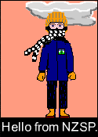
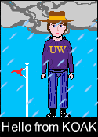
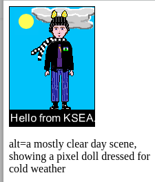
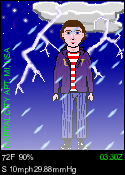
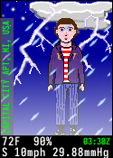

## tasks.md

Progress on expressJS server branch

Thu 14 Mar 2024 11:22:41 AM PDT

jimp composition model selfie and starry night layers


Pomodoro intention: engage with task flow.

Tasks

- [X] Mask the broken Jasmine test for composer (node-canvas removed).
- [X] Verify jimp Jasmine test works.
- [X] Verify jimp compose.js mini script works. `node compose.js` and compare pixie.png with above.
- [X] Verify jimp express demo works. Use `npm run dev` and see [localhost:3000/pixie/](http://localhost:3000/pixie/)
- [X] Decide on next step (decided: serve PNG pixie, use async/await for Jimp)

Pomodoros
11:24:32 AM PDT
+ Mask the broken composer test, verify other functions work.
+ Set up for pairing, try "serve PNG pixie" as interim task. Success (html/base64 png img).

Fri 15 Mar 2024 03:21:30 PM PDT
Notes for tasks.

Note: "fetch" in the in-browser-composer uses this form of refreshing the weather report:
```
curl -s https://tgftp.nws.noaa.gov/data/observations/metar/decoded/${SITE}.TXT > ${SITE}.TXT
```

Sample load-font-then-print from jimp docs:
```
Jimp.loadFont(Jimp.FONT_SANS_32_BLACK).then((font) => {
  image.print(font, 10, 10, "Hello world!");
});
```

Tasks

- [X] Write image text using Jimp. "imagetext" [jimp image.print](https://github.com/jimp-dev/jimp/tree/main/packages/jimp#writing-text)
- [X] Use the "fetch" template URL and node http client to get a METAR weather report. "proxy" [MDN fetch](https://developer.mozilla.org/en-US/docs/Web/API/Fetch_API/Using_Fetch)

Pomodoros:
* [X] Get doc links, record in tasks above, and open in tabs.
* [X] Jimp imagetext


Mon 25 Mar 2024 11:16:27 AM PDT

Tasks

- [X] Parse fetched weather report to pixie param JSON.

We now have a launcher page at '/', and '/metar?location=', '/json?location=' endpoints.

Thu 28 Mar 2024 09:04:10 AM PDT

Paired work @jmeowmeow / @binhrobles

- [X] Pass parsed params to "compose" logic, decide some layers, write some text.
- [X] Unpack metadata (parsed weather params and sun angle) alongside PNG output.
- [X] Use JIMP to compose the chosen layers and write param-specific text.

* We now have `/compose?location=` with default `?location=KSEA`
* `/compose` uses live weather report information for location text and to choose day/night background.


Sat 30 Mar 2024 10:00:00 AM PDT

- [X] Add temperature-to-pixel-doll layer choice logic.
- [X] Add cloud layer logic.
- [X] Add wind flag layer logic.




Next Steps
- [X] Turn composition back into a stack of optionally composed layers.

Mon 01 Apr 2024 08:33:11 AM PDT
Pomodoro intention: factor the composition into a list of variable length
but predictable order. Maybe reintroduce the Layer class at some point.
P1, P2 : progress. We're loading and composing an arbitrary list of layers, but not yet selecting a variable number.
There are empty transparent layers which could be slipped..
P3 : rabbit-hole on top index page table presentation (useful, but not specific to intention).
P4 : factoring complete, but kept working past timer.
Next intention: add weather layer logic.

- [X] Add weather layer logic.



Thu 04 Apr 2024 08:47:09 AM PDT

Working with Isaac.

- [X] Restore lightning layer logic. (behind rain)

Wed 10 Apr 2024 05:52:22 PM PDT

- [X] Restore top-layer black frame under text (fixes messy fog etc).
- [X] On network error, return a no-info default report.


Fri 12 Apr 2024 10:06:36 AM PDT

Starting off net, so font tools to convert standard to bitmap are offline;
  you could hack around with a BMP font to change its color.
Accessible during bus commute: canned reports, alt text creation, pixel
  doll set choice.

Tue 16 Apr 2024 08:16:07 AM PDT

On Monday (bus and after): restored Layer class; draft alt-text composition.

Tuesday Intentions:
- [X] inspect console.log() statements; make to-dos? scrub? (Scrub.)
- [ ]  return alt-text to web output (not yet)
- [X] compose weather text, see pixie-composer/writeTextOnPixie

Tuesday intentions mostly complete.

Incidental fix re KLAN.TXT report:
- [X] Thundershowers ("light rain with thunder", "rain with thunder") now render as rain.

Wed 17 Apr 2024 08:14:07 AM PDT
Wednesday Intentions:
- [X] add alt-text to web output as alt=""
- [ ] description text varies by pixie set and/or background style (fireworks?)

Wednesday also did:
- [X] prototype vertical location text on pixie (rotate -90 deg, print, rotate +90 deg).



Thursday did:
* Improve image text computation, extract to a pure-function file.
* Added fallback to a saved local METAR for better offline (bus) work.

Fri 19 Apr 2024 09:36:17 AM PDT
* Fixed fallback by using a sync read and catch block.
* Checked in Thursday work.

Friday intentions: Typeface/font or pixie choice
- [X] Attempt using The Gimp to transform white typeface to green.
- [ ] Online? try transforming a monospace font to white and to green
- [ ] Choose a pixie set in the API. This may drive a preload of layers.


Result: It looks like I might want a genuinely bitmapped font; Open Sans doesn't
do a great job at 8-point (or whatever the size unit is).

Tuesday: Or I could try a brighter but less saturated green, 7f7 instead of 0f0.

Mon 22 Apr 2024 08:21:23 AM PDT

Jimp fonts are BMFont format, see AngelCode's conversion tool. I don't
really need all the font metrics and kerning info if I'm going to use
fixed width bitmap fonts - maybe not even anti-aliasing - but I need
the font descriptor file and the image. I mean, I suppose I could sprite
a font and turn it into images and stick the character and rendered
string images into resources and do everything with image compositing.
HTML-5 Canvas and save-as-PNG are right there, and the list of characters
is present in the Jimp font XML file. They look like Unicode code points
for most of the printable characters 32-255 plus Euro Sign. It's tempting!
32-126 (US-ASCII printables), 161-255, 8364 (Euro). Checking 129-160,
129 is Euro (though maybe 129 is a problematic codepoint?), Glyphs for
codepoints 130-160 appear OK to dispense with.

Tue 23 Apr 2024 08:14:02 AM PDT

Tuesday intentions: preloads.js for resources. I suppose we could
import Jimp there because otherwise it's not clear how we get from
a loaded file to a Jimp image.

The "resources" container returned from preload includes a layer
map including pixie doll layers by type. Maybe we preload the ICAO
METAR stations as well, which sets us up for random weather station
picking and for map based lookup.

- [X] Preload and return icao.js stations as part of preloads.js
- [X] Show icao station info on pixie rendering or json page

Defer next steps.

Incidentally:
- [X] Render weather text info onto bottom weather bar. Needs a good font still.



Wed 24 Apr 2024 08:45:23 AM PDT

Experiment: find a BMFont generator. Apparently BMFont is a format used
for computer game development, and that's where some of the tools are.
For example, [Hiero](https://libgdx.com/wiki/tools/hiero) is a BMFont-capable tool in a suite of gamedev tools.
It fails to launch on my installed Java version. LibGDX suggests "Adoptium's OpenJDK 8".
[Adoptium.net](https://adoptium.net/index.html)

Wednesday intentions: preloads, an offline finer point.

Considering how to mix preloaded and lazy-loaded layers in compose-async.
Ultimately the Jimp images are overlaid in order. The existing code
peels off the file paths, turns them into Jimp object constructors,
and uses Promise.all() to wait for all the images to be loaded.

If some layers are preloaded, should I render them as fulfilled
promises? Or can I mingle them in the peel / construct / overlay
loops somehow? Maybe debugging through the composition loops would
be most helpful.

Fulfilled promise example (MDN):

const promiseA = new Promise((res, rej)) => { resolve(123); } );

- [ ] Preload and return weather layer map as part of preloads.js
- [ ] Preload and return one pixie set's layers.
- [ ] Preload and return all pixie sets' layers (by number and name?)
- [X] If a station code is absent from "stations" (icao.js), don't fallback to Lansing.

Thu 25 Apr 2024 06:01:05 PM PDT

Thursday intentions: continue with Layer/Promise.
- [X] Add Layer method toJimp() returning a Promise to load the path.
- [X] Preloads for "none" and "black frame" return a pre-fulfilled Promise.

We're now a modest step from moving some or all to preloads.

Fri 26 Apr 2024 09:21:28 AM PDT

After yesterday's trouble finding useful BMFont resources, RedBlobGames
suggests this project for TTF to BMFont: [msdf-bmfont-xml](https://github.com/soimy/msdf-bmfont-xml).

From RedBlobGames' [Distance Field Effects](https://www.redblobgames.com/x/2404-distance-field-effects/) post.

System TTF files here: /usr/share/fonts/truetype/

```
$ find /usr/share/fonts/truetype/ -print | grep Mono
```

Hopefully msdf-bmfont-xml  won't be a bust on binary library requirements
like Hiero (not yet trying JDK8 as suggested), though I believe I have
Cairo-lib available. Anyway we'll struggle on with the BMFonts in Jimp.

See Soimy's (Shen Yiming, Shader Studio) [msdf-bmfont-xml](https://soimy.github.io/msdf-bmfont-xml/)

$ msdf-bmfont --help

Well uh. "signed distance format" is not useful for me in any direct way. Jimp can
use it for print() but SDF/BMFont sprites encode geometry rather than pixel rendering.

So back to AngelCode BMFont, JDK8 and Hiero, or [Shoebox](http://renderhjs.net/shoebox/). Oops no not Shoebox, not for Linux.

Friday intentions
- [X] Move blank and black frame in resources/preloads.
- [ ] Move weather into preloads.
- [ ] Dispatch to a specific pixie set somehow.

Mon 29 Apr 2024 08:05:30 AM PDT
Monday intentions:
- [ ] Dispatch to a specific pixie set somehow.
- [ ] Move weather into preloads.

Pixie set: Is the doll description JS re-work on the browser branch of Git?

Art inspiration spotted on the bus: kitten-toast dangle on a
light purple ita bag. kitten face framed by light brown bread
crust and a little spongy surface, back part of kitten sticking
out behind the slice of bread.

### Next step detail breakdown
- TO ACCOMPLISH: Restoring text-on-image (station text; report text)
- [X] Open the JIMP docs for [printing text](https://github.com/jimp-dev/jimp/tree/main/packages/jimp#writing-text) to the image using bitmap fonts.
- [X] Assemble an object with the weather and station text.
- [X] Write that object to the ~~pixie compose~~ *JSON report* page text (JSON.stringify)
- [X] Investigate rotating text 90 degrees left for station name
- [X] Write white and green weather text from the assembled text object.
- [X] Write the vertical text for the station name.
- [X] Find a suitable console typeface/font for JIMP. Import it.
- [X] Create a white fixed font resource with the necessary glyphs.
- [X] Create a green fixed font resource with the necessary glyphs.
- [X] Refer to the pre-existing station name process (green fg, pink bg).
- [X] Revise prototype writing to use preferred fonts.
- [X] THEREBY: Restoring text-on-image (station text; report text)

Iosevska SS04 claims to be Menlo-like. I've used Hiero to create
BMFont pixel font definitions. The rendering doesn't seem as crisp
as I'd like (TrueType to pixel, rather than native pixel font) but
I can dot it in since I want a fixed-width font.



Maybe I want a /credits or /about which describes tools and stuff
used, including font resources and the Recurse Center.

### Alt text creation breakdown (complete in mechanism, pending user UI composition)
- TO ACCOMPLISH: Creating alt-text describing an image.
- [X] Introduce Layer class following the pattern for Layer, mainLayerDefs in pixie-composer.js .
- [X] Add an alt-text composer based on computeSceneText (layer.desc), computeAltText.
- [X] Put the alt text in the alt= attribute of the composed image.
- [X] THEREBY: Restoring alt-text generation.

Thu 30 May 2024 09:08:57 AM PDT

The Express/Jimp/Node stack is producing acceptable pixies with text.

We still need to be able to use and choose alternate pixie sets.

Thursday intentions:
- [X] Collect necessary tasks from above and move below. *(we're good, actually)*
- [X] Investigate longitude logic. I think EGLC is wrong in parsing minutes of longitude. *It's actually fine, the disagreement was ICAO.js (03 min east) versus the live report (30 min west)*.
- [X] Collect a task group for soft launch. Use "Full PixieReport" below.
- [X] Collect a task group for being ready for code review / promotion to main.

* Tasks from above are reflected in "Jimp Layer and Pixie Preload breakdown" and "Next Step Directions" below.
* Approaches to a common preload / overload mechanism.
    * We have `layerDefsPixie0.js`, etc., whose weather and bg defs are largely redundant.
    * We could keep the weatherhash, skyhash, etc. with Pixie0.js or factor them out.
    * Maybe each pixie set will have a named layer map with pixie layers and any overrides.
    * "overrides" = right now the night fireworks background, or the night comet for Moomin.
* Probably easier to read the data setup if we pull out the standard weather/bg/cloud layers.

- [ ] When no data loads: put in the METAR station code, not ????; align "no time". *When investigating this, I see it's part of the METAR parser.*


Fri 31 May 2024 08:56:00 AM PDT

Friday intentions:

- [ ] Move forward on the preloads extraction.

So far: pixies.js is aggregating the various pixie sets but
wants to be re-done with actual Jimp Layers I think.

Mon 03 Jun 2024 08:41:38 AM PDT

Monday intentions:

- [ ] Move forward on the extraction of layers from compose-async to preloads

Results: a promise doesn't hold the current working directory, so anything
escaping "preloads" ends up as a file-not-found. Awkward coupling outside
of the original Layer definitions that wants an extra trip to the filesystem
to resolve.

Tue 04 Jun 2024 08:45:28 AM PDT

Tuesday intentions:

- [X] Get the preloaded layers working. It's OK to put a Promise.all() to provoke loads.

The Promise.allSettled() is logged right after the server starts to listen. Since
I gave up on ES6 modules, we have messier behavior around forced-async loads of
necessary resources.

Working for background, clouds, and weather. Fixed an issue where we were
accumulating layers onto the background by adding a fresh blank image buffer
to composite the pixie layers. Yay!

Wed 05 Jun 2024 08:53:25 AM PDT

Wednesday intentions:

- [X] Complete extraction of weather and wind layers from compose-async to preloads. _We could use better logic for missing weather conditions, maybe addByNameIfDefined()._

Pixel doll items rolled over to Thursday, Friday

Thu 06 Jun 2024 09:21:46 AM PDT

EoD: scrubbed all non-preloads, left with setting up the pixel doll image loading.

Fri 07 Jun 2024 09:18:51 AM PDT

Pixel doll image preloads were a bit of a mess.

Pixel doll layers and alternate backgrounds. Rolling over items from Wednesday.
- [ ] Choose naming scheme for pixie set via get layer by name
- [X] Use preloaded pixel doll layers (pixiebunny)
- [ ] Use alternate backgrounds for Moomin night, holiday night

Mon 10 Jun 2024
* Deployed previous ("selfie") version of the dev server publicly.

Tue 11 Jun 2024 10:23:52 AM PDT
* Deployed latest ("bunny", pixie preloads) version of the dev server publicly.

Tuesday intentions:
- [ ] Preload all doll sets with alt-text descriptions.
- [ ] Choose naming scheme for pixie set via get layer by name

Wed 12 Jun 2024 09:18:25 AM PDT

Deploying was super fun because I got to hit the URL and see it
working and I got to share with M.D. Hill and others.

A thought: right now the response for the / and the /compose
endpoints are really developer views.
What would the user view be? Other stations nearby?
What would the navigation be?

The site, in my imagination:
* has a landing page
* responsive layout for main site pages
* has left or top nav - what are minimum ARIA
* has a pixie builder wizard
* can support bookmarking or redirection
* can serve just-the-picture or an image transclusion-as-iframe
    * can an iframe support javascript or SVG+js doc content?
* should be kind of usable with different devices: media selectors?

Right. iFrames. The Frame plugin.

I guess I'll, idk, ask the question in a couple of forums?

Also, recall that HTTP headers (or meta tags) support content
refresh, which was the neat trick behind the Web Slideshow:
serving a header which instructed the browser to refresh the
view, then serving a Location for the content. Can an iFrame
have "meta refresh" in it to pull the same trick? Saves us
a pile of client-side javascript.

Wednesday intentions: rollover Tuesday
- [ ] Preload all doll sets with alt-text descriptions.
- [ ] Choose naming scheme for pixie set via get layer by name

Thu 13 Jun 2024 09:39:59 AM PDT

compose-async.js addDollLayer is using a random pick now.
Can we move the pick to the server code via the params?

Thursday intentions: rollover Wednesday
- [X] Preload all doll sets with alt-text descriptions.
- [X] Choose naming scheme for pixie set via get layer by name
- [X] Exercise the various pixie sets randomly.
- [ ] Address which pixie set via params.


Fri 14 Jun 2024 10:13:09 AM PDT

Friday when I can:
- [X] Fix the shortloc regex to key off the station name not parentheses.
- [ ] Address which pixie set via params.
- [ ] Scan launch readiness tasks below and pull up to next steps.


Mon 17 Jun 2024 08:58:38 AM PDT
Monday intentions: rollover Friday.
- [X] How about a favicon? I think the main branch has one.

Also added a page for tasks accomplished, separate from here.

Initial Lea Verou favicon to main '/' response. Guess we might want templates.

Tue 18 Jun 2024 09:42:11 AM PDT
(from Monday)
- [X] Scan launch readiness tasks below and pull up to next steps.
- [ ] Address which pixie set via params.
- [ ] Track no-report ICAO METAR station codes to incrementally cull from icao.js
- [ ] PNG output endpoint, either png/station (or select via .png path extension?)

Wed 19 Jun 2024 09:34:28 AM PDT
Attempted but failed (before commute) to find the bulk METAR data download
in order to get a sense of which stations were updating with fresh reports.
Maybe try [NOAA MADIS](https://madis.ncep.noaa.gov/madis_metar.shtml)

Or use the URL in the comment next to fetchMETAR:
[metars.cache.csv.gz](https://aviationweather.gov/data/cache/metars.cache.csv.gz)

- [X] PNG output endpoint (and mini-gallery on root / path). We lose alt text.

## Next Step Directions
- [X] Restore pixel doll sets (random; chosen by URL) see above Pixie Preload with text
- [ ] Instead of defaulting KSEA, random pixie via hit and redirect
- [ ] HTTP refresh header slideshow of random pixie
- [ ] Log 404s from actual METAR source, scrub candidates from ICAO.js .
- [ ] Refresh ICAO.js by grabbing a whole-set zip and examining freshness.
- [ ] Rethink URL path handlers, remove unneeded ones.
- [ ] Explore ICAO METAR stations (random, like Twitter PixieReport).
- [ ] METAR stations as a queryable database; how to query? what lists?
- [ ] Pick METAR stations from a map, like FedWiki map marker plugin.
- [X] Restore open street map link. *In prototype Express web UI.*

### Jimp Layer and Pixie Preload - done, see [./done](./done.md).

### Tasks to be Ready for Main Branch / Code Review

* Presumes "Full PixieReport Function" below (pixie sets, etc.)

- [ ] Remove unused files and functions from other versions.
- [ ] Remove neglected endpoint handlers which have served their purpose
- [ ] Remove console.log for routine operations.
- [ ] Update the prospectus document.
- [ ] Add an about/credits/source/acknowledgements page to the source.
- [ ] Consider assertions as a prelude to tests.
- [ ] Consider TheDryPrinciple for resources.
- [ ] Is there a jslint to run for suggested cleanup?
- [ ] Express.js model app format to review?
- [ ] Replace let or global with const as possible.
- [ ] Name output template strings rather than leaving nameless inline.


---

Next Logical Steps (next *notional* steps for evolutionary architecture?)
- [ ] Factor out layer map into a layer locator passed from the server main program and/or export it to a resource helper.
- [X] Verify the layerfile composition, maybe /layers (or echo it alongside /compose output)

Full PixieReport function (minus the weather report location choosing wizard) needs
- [X] Get a font matching the original WeatherPixie loaded into Jimp
- [X] Write the weather report text on the image
- [X] alt-text in the HTML page presentation using pre-existing logic
- [ ] Choose a pixel doll set with UI/URL parameter
- [ ] Group pixie-set-specific weather layers separately from generic weather?
- [ ] PNG output endpoint or PNG-data-img is fine. Or select just-image as ".png" or ".jpg" like http.cat ?
- [ ] Graceful error handling for missing report data or fetch failure
- [ ] Cacheable URL scheme (path params vs. query params?) responses, cache headers.

Weather Report Choosing Wizard
- [X] prototyped in fedwiki with web-linked markers on Leaflet map widget

